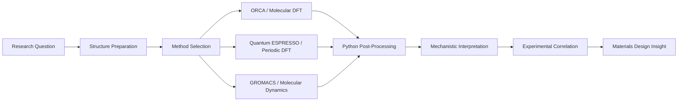

# Evangelia Mitropoulou

Computational chemist focused on polymer and materials chemistry, with hands-on experience spanning quantum chemistry, periodic DFT, molecular dynamics, HPC workflow design, and scientific automation.

This repository is a curated technical portfolio built from a larger working research codebase. It is designed to show how simulation, analysis, and infrastructure come together in real computational chemistry projects, with emphasis on materials problems rather than toy examples.

## Portfolio Highlights

- **Flame-retardant materials modeling:** DFT-driven analysis of phosphorus-containing systems, conformer ranking, bond metrics, and experiment-linked mechanistic interpretation.
- **Polymer molecular dynamics:** end-to-end GROMACS workflow for isotactic polypropylene melt simulations, including staged equilibration, production MD, and thermodynamic analysis.
- **Periodic materials modeling:** Quantum ESPRESSO workflows for crystalline systems, from CIF-based structure preparation to relaxation and SCF calculations.
- **HPC and reproducibility:** Linux, SLURM, bash automation, software bootstrapping, and monitoring for computational chemistry environments.

## Selected Projects

### 1. [Flame-Retardant Materials Case Study](./projects/flame-retardants/README.md)
Computational analysis of phosphorus-based flame-retardant candidates, linking DFT-derived metrics to decomposition behavior, char formation, and substituent effects.

### 2. [Polymer Molecular Dynamics Case Study](./projects/polymer-md/README.md)
GROMACS workflow for isotactic polypropylene melt simulation, including system staging, run strategy, and representative thermodynamic outputs.

### 3. [Periodic DFT Case Study](./projects/periodic-dft/README.md)
Quantum ESPRESSO workflows for inorganic and crystalline materials, demonstrating periodic structure preparation, relaxation, and solid-state modeling practice.

### 4. [HPC Workflow & Research Infrastructure](./projects/hpc-infrastructure/README.md)
Automation and observability for chemistry workloads using SLURM, bash, Docker, Prometheus, and Grafana.

Each project folder now contains representative source artifacts copied from the working research repository, including real scripts, inputs, analysis files, and infrastructure configuration.

## Presentation

- [Portfolio Overview Deck (Marp)](./presentations/portfolio-overview.md)

## Workflow Map



## Repository Structure

```text
portfolio/
├── assets/
│   ├── figures/
│   ├── images/
│   └── pdfs/
├── docs/
├── presentations/
└── projects/
    ├── flame-retardants/
    ├── hpc-infrastructure/
    ├── periodic-dft/
    └── polymer-md/
```

## Technical Stack

- **Quantum chemistry:** ORCA
- **Periodic DFT:** Quantum ESPRESSO
- **Molecular dynamics:** GROMACS
- **Conformer workflows:** CREST / xTB-style sampling pipeline familiarity
- **Programming:** Python, Bash
- **Research computing:** Linux, SLURM, MPI-oriented execution
- **Infrastructure:** Docker, Prometheus, Grafana
- **Application domain:** polymers, flame-retardant systems, structure-property relationships, materials chemistry
