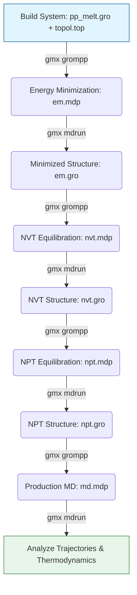
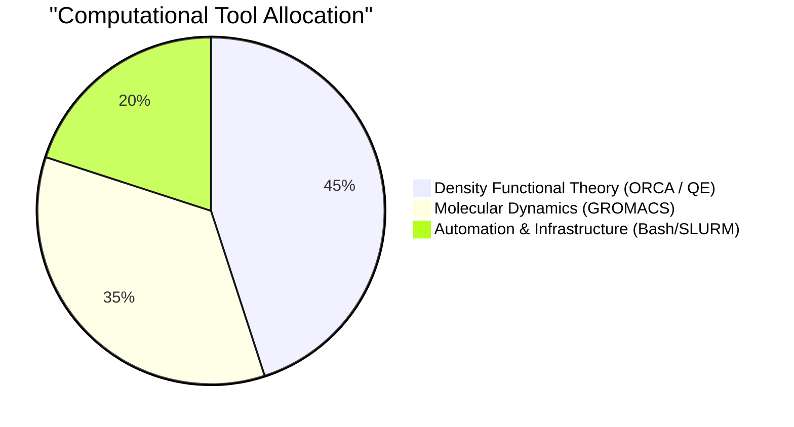

# Evangelia Mitropoulou: Technical Portfolio
**Computational Materials Scientist | ORCA, GROMACS, Quantum ESPRESSO, HPC Automation**

This portfolio demonstrates my hands-on experience building and maintaining automated, reproducible computational chemistry workflows. All examples below are excerpted from my independent research repository, demonstrating my ability to take a simulation from initial environment setup through execution and data analysis.

---

## 1. High-Performance Computing (HPC) & Infrastructure Automation
*I believe that reproducible science starts with reproducible infrastructure. I write "Infrastructure as Code" to ensure that my simulation environments are identical across clusters.*

### Automated Cluster Bootstrapping (Bash)
Instead of manually installing software on every new cluster node, I use automated bash scripts to deploy **ORCA**, **Quantum ESPRESSO**, and monitoring stacks (Prometheus/Grafana).

```bash
# Excerpt from: infra/bootstrap.sh
function install_qe() {
    sudo apt-get install -y build-essential gfortran mpich libfftw3-dev liblapack-dev libblas-dev
    sudo tar -xzf "$QE_TARBALL" -C "/opt/${QE_VER}" --strip-components=1
    
    # Configure and build QE using MPI
    (cd "/opt/${QE_VER}" && ./configure MPIF90=mpif90 F90=gfortran && make pw -j"$(nproc)")
    sudo ln -sfn "/opt/${QE_VER}" /opt/qe
}

# Ensure monitoring stack is active for simulation observability
function start_monitoring() {
    sudo systemctl enable --now prometheus-node-exporter
    cd "$HOME/infra/monitoring" && docker compose up -d
}
```

---

## 2. Molecular Dynamics (MD) Workflows: Polymer Melts
*I design end-to-end Molecular Dynamics pipelines using **GROMACS**. This example shows a workflow for an isotactic polypropylene melt (L-OPLS force field, 473.15 K).*

### 2a. Simulation Pipeline Design
My standard polymer pipeline moves rigorously through Energy Minimization, NVT equilibration, NPT equilibration, and finally Production MD.



### 2b. HPC Execution (SLURM)
I optimize GROMACS performance on CPU clusters by explicitly managing MPI and OpenMP threads to maximize throughput for large polymer systems.

```bash
#!/bin/bash
#SBATCH -J pp_melt
#SBATCH -N 1
#SBATCH --ntasks=8
#SBATCH --cpus-per-task=8
#SBATCH --time=24:00:00

source /opt/gromacs/2024.4/bin/GMXRC
srun gmx_mpi mdrun -deffnm prod -ntomp $SLURM_CPUS_PER_TASK -pin on
```

---

## 3. Quantum Chemistry (DFT): Solid-State & Molecular
*I utilize Density Functional Theory to understand structure-property relationships at the electron level. I use **ORCA** for molecular systems (flame retardants) and **Quantum ESPRESSO** for periodic/solid-state systems.*

### 3a. Periodic Systems with Quantum ESPRESSO
*Example: Variable-cell relaxation and SCF calculations for inorganic structures (e.g., Berlinite) using MPI distribution.*

```bash
#!/bin/bash
#SBATCH --job-name=a_berlinite_vc_qe
#SBATCH --partition=short

export OMP_NUM_THREADS=1 MKL_NUM_THREADS=1
export PATH=/opt/qe-7.5-ReleasePack/bin:$PATH

mpirun -np 32 pw.x -npool 4 -ndiag 2 \
    -in a_berlinite_vc_qe.in > a_berlinite_vc_qe.out
```

### 3b. Structure-Property Correlation & Visual Analysis
*I routinely extract quantitative data (bond metrics, vibrational frequencies, reaction energies) from DFT outputs and correlate them with experimental measurements like TGA and FTIR.*

*(Note: Data extraction is handled via custom Python parsing scripts, visualizing interactions using molecular rendering tools like Avogadro and NCIPlot).*


