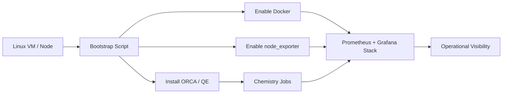

# HPC Workflow & Research Infrastructure

## Project Focus

Computational chemistry is not only about running calculations. Strong computational researchers also create environments that are reproducible, maintainable, and observable. This case study documents infrastructure and workflow work that supports chemistry workloads in practice.

## What Was Built

- bash-based environment bootstrap logic for ORCA and Quantum ESPRESSO installation
- path and binary setup for reusable Linux environments
- SLURM cluster configuration for multi-node CPU resources
- monitoring stack with Docker, Prometheus, Grafana, and node exporter
- dashboard provisioning for tracking host-level computational workload behavior

## Included Technical Artifacts

```text
hpc-infrastructure/
├── config/
│   └── slurm.conf
├── monitoring/
│   ├── docker-compose.yaml
│   ├── prometheus.yml
│   └── orca_basics.json
└── scripts/
    └── bootstrap.sh
```

### What Is Included

- `scripts/bootstrap.sh`
  End-to-end environment setup script for ORCA, Quantum ESPRESSO, Docker, and monitoring services.
- `config/slurm.conf`
  Real SLURM cluster configuration defining nodes, partitioning, and scheduler behavior.
- `monitoring/docker-compose.yaml`
  Minimal service orchestration for Prometheus and Grafana.
- `monitoring/prometheus.yml`
  Prometheus scrape configuration for host monitoring.
- `monitoring/orca_basics.json`
  Provisioned Grafana dashboard for compute-node observability.

## Infrastructure Workflow



## Why This Is Worth Showing

This is unusual in a chemistry portfolio. Most candidates can describe software they used; far fewer can show that they understand how the computational environment itself is provisioned and monitored.

## Selected Technical Evidence

### Bootstrap Automation

The source workspace includes automation for:

- dependency installation
- ORCA extraction and path wiring
- Quantum ESPRESSO installation and optional build
- Docker and monitoring startup

### SLURM Configuration

The source workspace includes a real cluster configuration with:

- node definitions
- partition setup
- authentication and control configuration
- completion hooks

### Monitoring

Dashboard provisioning shows awareness of:

- CPU load
- memory/swap behavior
- basic observability for sustained computational workloads

## Core Competencies Demonstrated

- Automating the deployment of Linux-based computational chemistry environments
- Orchestrating multi-node CPU resources and scheduling pipelines via SLURM
- Engineering robust, reproducible workflow infrastructures suitable for both academic and industrial R&D
## Source Repository Coverage

Primary source material for this case study came from:

- `Computational-Chemistry/infra/bootstrap.sh`
- `Computational-Chemistry/infra/slurm/slurm.conf`
- `Computational-Chemistry/infra/monitoring/`
