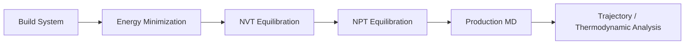
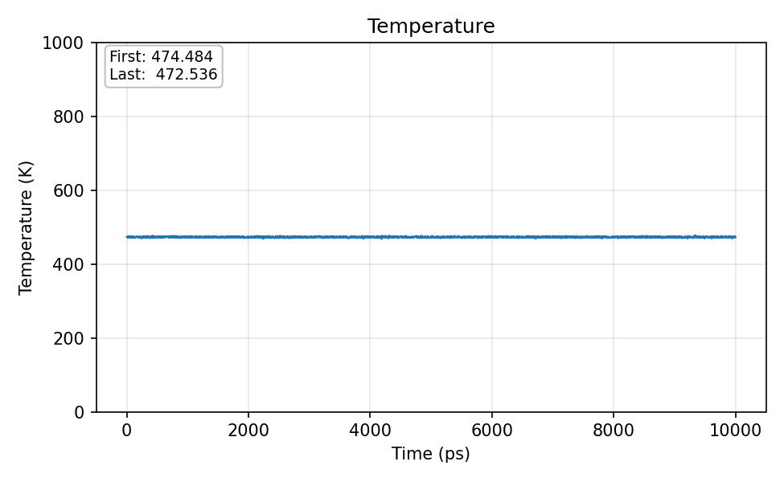
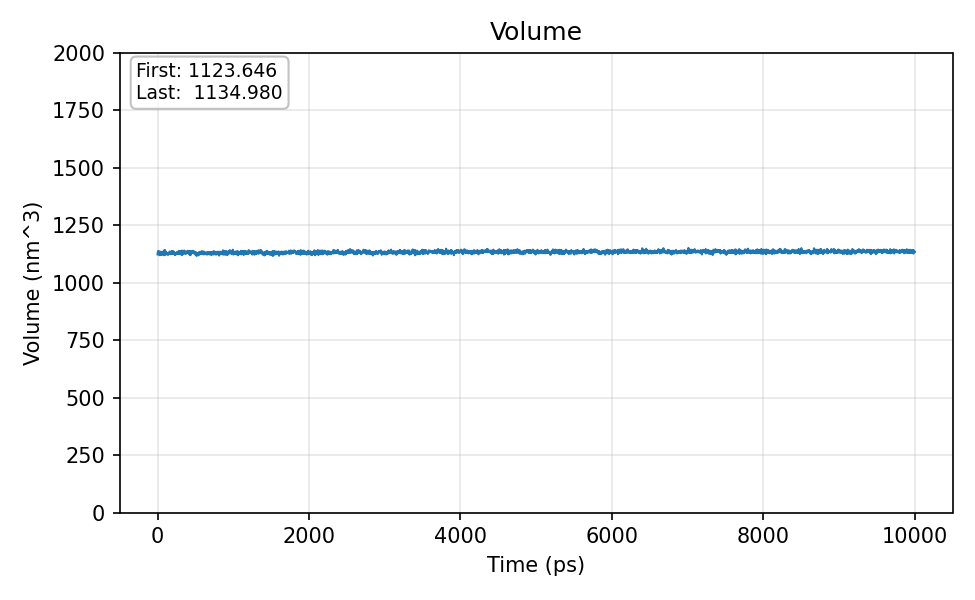

# Polymer Molecular Dynamics Case Study

## Project Focus

This case study showcases an end-to-end molecular dynamics workflow for an isotactic polypropylene melt using GROMACS and the L-OPLS force field. The project is useful as a portfolio piece because it demonstrates practical simulation staging, reproducibility, and interpretation of thermodynamic outputs in a polymer context.

## System

- isotactic polypropylene melt
- 75 chains x 160 monomers per chain
- cubic simulation box
- L-OPLS force field
- elevated-temperature run strategy for melt behavior

## Workflow



## What Was Done

- Organized the simulation into clear stages: build, minimization, NVT, NPT, and production.
- Preserved reusable topology and force-field structure for portability and reproducibility.
- Generated thermodynamic outputs including density, pressure, temperature, volume, and box-dimension traces.
- Documented transfer and restart logic so simulations can be resumed or migrated cleanly.

## Included Technical Artifacts

```text
polymer-md/
├── analysis/
│   └── data_extract.sh
└── inputs/
    ├── em.mdp
    ├── nvt.mdp
    ├── npt.mdp
    ├── md.mdp
    └── topol.top
```

### What Is Included

- `inputs/em.mdp`
  Energy-minimization settings for the initial cleanup stage.
- `inputs/nvt.mdp`
  NVT equilibration configuration for temperature stabilization.
- `inputs/npt.mdp`
  NPT equilibration configuration for density and pressure equilibration.
- `inputs/md.mdp`
  Production MD settings for sustained simulation.
- `inputs/topol.top`
  Representative top-level topology entry point for the polymer system.
- `analysis/data_extract.sh`
  Shell-based extraction workflow for post-processing simulation outputs.

## Why This Is Worth Showing

Many candidates claim MD experience, but strong portfolio evidence comes from showing that the simulation was structured properly, documented clearly, and paired with interpretable outputs. This project does that.

## Representative Outputs

### Density


### Temperature


### Pressure


### Volume


## Core Competencies Demonstrated

- Designing and executing production-scale molecular dynamics workflows for polymer systems
- Managing simulation continuity, checkpoints, and reproducibility across HPC environments
- Processing raw simulation trajectories into interpretable thermodynamic and structural outputs

## Source Repository Coverage

Primary source material for this case study came from:

- `Computational-Chemistry/MD/GROMACS/pp_melt/`
- `Computational-Chemistry/MD/GROMACS/README.md`
